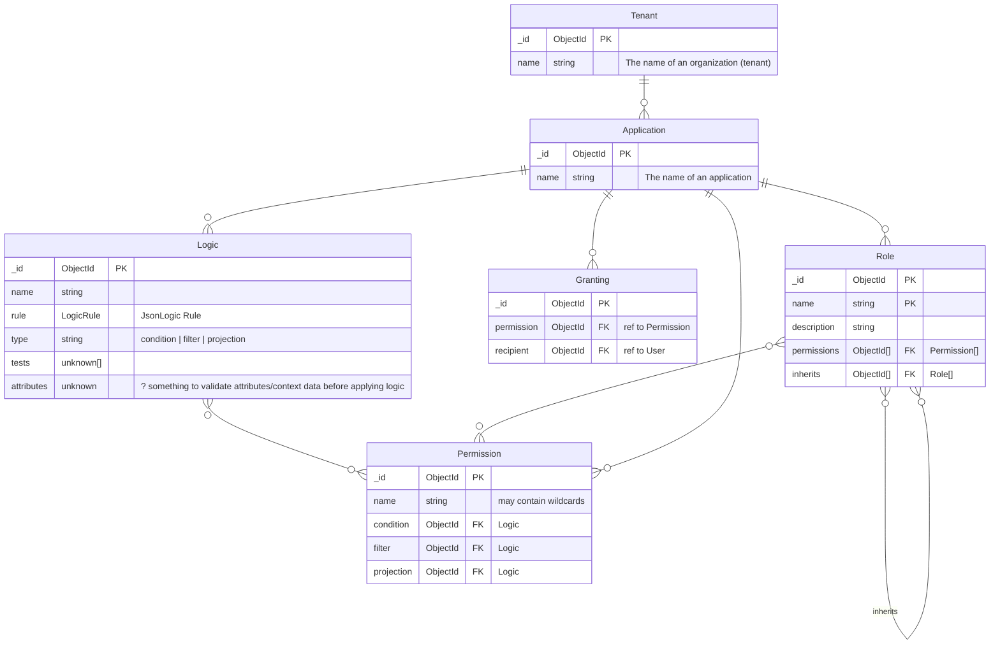

# Developer Friendly Access Control with Policy as JSON

An intuitive open source authorization and access control platform for software applications and microservices.


[Learn more!](https://policer.io)

##

[](https://www.docker.com/)
[](https://embrio.tech)

## :books: Table of Contents

- [:spider_web: Architecture](#spider_web-architecture)
- [:construction_worker: Development](#construction_worker-development)
- [:bulb: Concepts](#bulb-concepts)
- [:speech_balloon: Contact](#speech_balloon-contact)
- [:lock_with_ink_pen: License](#lock_with_ink_pen-license)

## :spider_web: Architecture


_Figure: Architectural diagram of the application and environment architecture._

### Policer API

#### `api`

[](https://git.embrio.tech/embrio/policer/api/pipelines)

The API service of the policer app.

Submodule embrio/policer/api>

<!-- ##### :seedling: Staging

Access staging at https://s.mypolicer.ch

- Start a [EC Support Flow](https://s.mypolicer.ch/consultation?flow=646e2412578910064ddf2661)
- Start a [Demo Flow](https://s.mypolicer.ch/consultation?flow=64525acc2292ae9a5b09800a) -->

## :construction_worker: Development

### Prerequisites

#### Docker

You need [Docker](https://www.docker.com/products/docker-desktop) :whale: for running the development environment.

#### Visual Studio Code

We strongly recommend you to use the [Visual Studio Code](https://code.visualstudio.com/) editor and IDE.

#### Clone Repository with submodules

You need to clone this repository **with the submodules** by using the `--recurse-submodules` option.

    git clone --recurse-submodules ssh://git@git.embrio.tech:2224/embrio/policer/development.git

##### New Submodules

When new submodules are added or you forgot to use `--recurse-submodules` when cloning, you can execute

    git submodule update --init

to update and initialize the submodules. More on (git submodules)[https://git-scm.com/book/en/v2/Git-Tools-Submodules].

#### Environment Variables

You need to initalize the environment variables. :warning: NEVER commit any secrets to the repository. If you need to store secrets—such as cloud credentials—consider using [`git-secret`](https://github.com/sobolevn/git-secret#readme) to encrypt the `.env` files.

##### Global `.env`

    cp sample.env .env

##### Service specific `.env`

    cp <SERVICE-PATH>/sample.env <SERVICE-PATH>/.env

So, for example:

    cp policer-api/sample.env policer-api/.env

### Run

To run all services execute

    docker compose --profile policer up -d

#### DB Seeding

When the volumes do not exist, DBs are seeded with data by the initialization scripts in `init/...-db/`. To create a new DB seeding dumps check out [Create New DB Dumps](#create-new-db-dumps).

### Inspect

To inspect the logs of a service

    docker compose --profile policer logs -f policer-api

### Access

#### `api`

:link: http://localhost:5010

### (Re-)build

To rebuild the container images of a service after dependency changes run

    docker compose --profile policer build <service-id>

So, for example

    docker compose --profile policer build policer-client

#### Rebuild everything

To rebuild everything you can also run

    docker compose --profile policer up --build

### Stop and Cleanup

To clean everything up run

    docker compose --profile policer down -v

:warning: this also removes the data in the development databases. Don't use `-v` option if you want to keep data.

### Create New DB Dumps

Run at least the DB containers with `docker compose up`.

#### `policer-db`

To create a new db seed dump, run

    docker exec development-policer-db-1 sh -c 'mongodump -d emt-policer-d --authenticationDatabase admin -u mongodb -p mongodb --archive' > ./init/policer-db/db_init.dump

<!-- #### `identity-db`

To create a new db dump, run

    docker exec development-identity-db-1 sh -c 'pg_dump identity -U postgres' > ./init/identity-db/identity_init -->

## :bulb: Concepts

### Data Models



### JsonLogic

#### Return Object containing dynamic values from JsonLogic

When a `Logic` rule should return an object or array, we can use a custom JsonLogic operation `"json"`. For example

```json
{
  "name": "filterPremiumWithoutSubscription",
  "rule": {
    "if": [
      {
        "var": "userHasSubscription"
      },
      {
        "json": "{}"
      },
      {
        "json": "{ \"premium\": { \"$in\": [{{first}}, {{second}}, {{first}}] } }"
      }
    ]
  },
  "type": "filter",
  "application": "65f0674f39d8a1a5ef805ca7"
}
```

#### Parse `json` string with custom JsonLogic operation

We can use placeholder with double curly brackets `{{myVariable}}` and parse values into the json string before we parse it.

##### Possible implementation

```javascript
const json = '{ "premium": { "$in": [{{first}}, {{second}}, {{first}}] } }'

const matches = json.matchAll(/{{(\w+)}}/g)

const data = {
  first: 23,
  second: true,
}

const replaced = matches.reduce((result, match) => {
  console.log(match)
  const [matched, group] = match
  return result.replace(matched, data[group])
}, json)

console.log(replaced)

const obj = JSON.parse(replaced)

console.log(obj)
```

## :speech_balloon: Contact

Talk to us via [policer.io](https://policer.io/contact/)

## :lock_with_ink_pen: License

The code is licensed under the [AGPLv3](/LICENSE) License.

## :clipboard: To Do and Backlog

- [ ] Policy decisions should be logged to maintain an audit trail.
    - PDP should emit a socket event
    - Policer API should log these events in DB
- [ ] Validate the required attributes before policy decision.
- [x] Policy versioning, change log history
- [ ] Support offline usage, cache policy locally and load it on PDP start if no connection.

